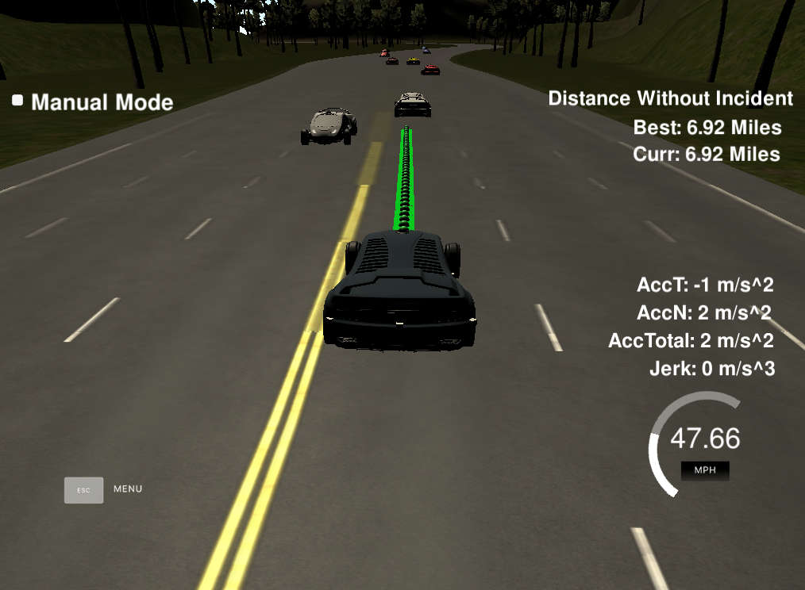
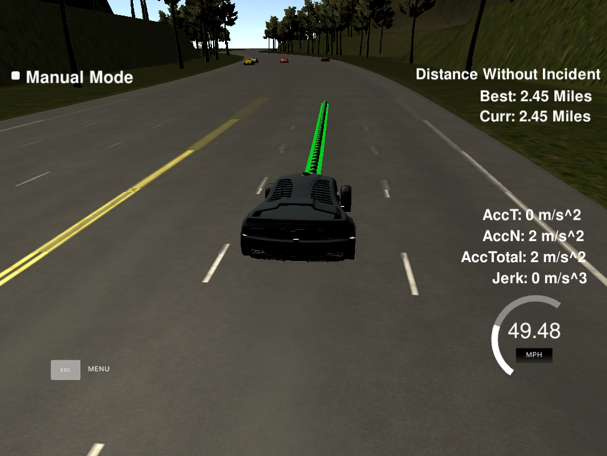
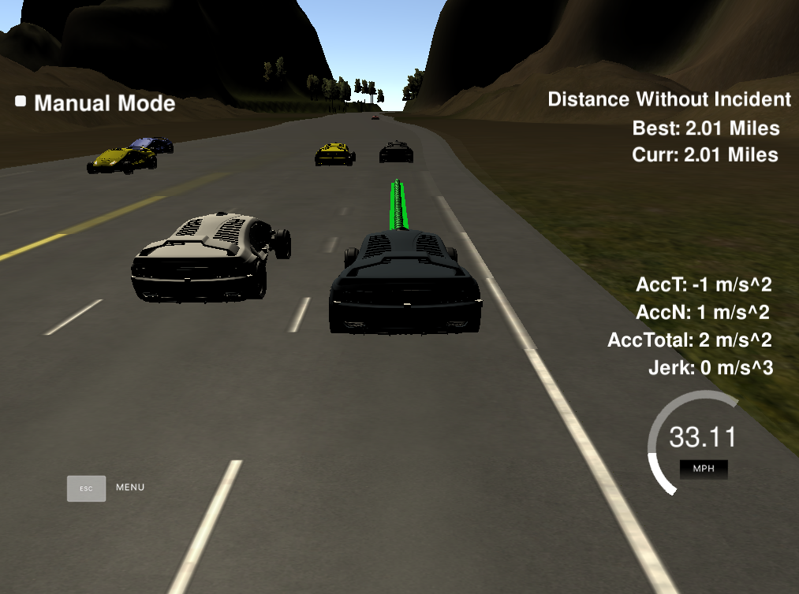
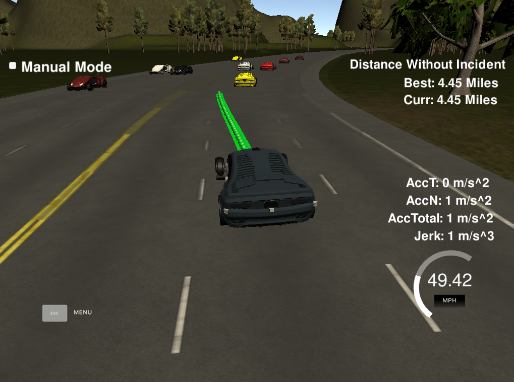

## Project: Path Planning

---

# Required Steps for a Passing Submission:
1. Start the Car on Highway simulation
2. Analyze surrounding environment.
3. Calculate the future trajectory of the car. 
4. Implement lane swith control.
5. Implement velocity and acceleration control.
6. Implement avoiding jerk control
7. Write it up.
8. Congratulations!  Your Done!

## [Rubric](https://review.udacity.com/#!/rubrics/1534/view) Points
### Here I will consider the rubric points individually and describe how I addressed each point in my implementation.  

---
### Writeup / README

#### 1. Provide a Writeup / README that includes all the rubric points and how you addressed each one.  You can submit your writeup as markdown or pdf.  

You're reading it! Below I describe how I addressed each rubric point and where in my code each point is handled.

#### 2. Valid Trajectories.

##### 1. The car is able to drive at least 4.32 miles without incident.

Yes the car is able to drive with any jerks or collisions or adverse incidents of any kind for over 6 miles. I didn't run the simulation more than that but I am sure it would go further without incident.

##### 2. The car drives according to the speed limit.

Yes the  Max Speed Limit is hard-coded in the code and the car doesn't go over it.

##### 3. Max Acceleration and Jerk are not Exceeded.

Yes the Max Acceleration is hard-coded in the code and the car doesn't go over it. Also, the car doesn't jerk because during switching lanes it decelerates.

##### 4. Car does not have collisions.

Nope the car didn't have any collisions whatsover.

##### 5. The car stays in its lane, except for the time between changing lanes.

Yes the car maintains proper lane discipline.

##### 5. The car is able to change lanes.

Yes the car is programmed to hit the max speed as much as possible so whenever there's a car ahead the car switches to any of the surrounding free lanes.

#### 3. Reflection.

I started off by analyzing the sensor fusion data. It is the best way to check the surrounding are and keep track of vehicles around our car. We can check if there's a car ahead of us or in our left or right lane. Once we have this data we can easily figure out if we should accelerate/decelerate or switch lanes or not.

Now since we know if there are other vehicles in our close vicinity or not we can define the behaviour of the car. The algorithm is built to maintain the max speed within the limit. So, if there's a car ahead of us and it's slowing our speed down we should switch to an adjacent free lane. If we switch lanes we should decelerate and switch to avoid jerks and then we should accelerate again. If there's no car ahead of us then we should maintain the speed limit.

We know the current position of the car and the surrounding info now we need to make sure that we choose the future waypoints of the car carefully.

To make sure we are moving in a contigous line we choose the current location and the previous location if we have it to calculate the future waypoints on the map. We then use these points to do the spline calculation. The coordinates are transformed to local car coordinates. In order to ensure continuity on the trajectory we add the previous path points to the next trajectory. The rest of the points are calculated by evaluating the spline and transforming the output coordinates to not local coordinates. We make sure the car maintains a constant velocity while calculating the future waypoints. The speed change is calculated for every trajectory points instead of doing it for the complete trajectory.
